# Exploratory data analysis: confident dataset

Dataset: the confident subset (human-labeled or confident-zone relevant videos only). 1,167 videos (youtube 542, tiktok 625). Collection date used as the reference date: 2026-10-02.
All numbers in this report are generated by `scripts/run_eda.py` from the data; nothing is typed by hand.
Statistical tests treat videos as independent, although some creators contribute many videos, so p-values are optimistic; effect sizes and confidence intervals are therefore reported, and the robustness step repeats the key results with a cap on videos per creator.

## 0. Data quality checks

Checks run before any analysis, so that charts and tests are not built on broken data.

- 1,167 videos (YouTube 542, TikTok 625); duplicate video ids: 0.
- YouTube: missing likes 7.4%, comments 39.1%, followers 1.1%, description 6.3%, tags 21.8%, hashtags 73.4%.
- TikTok: missing likes 0.0%, comments 0.0%, followers 0.0%, description 100.0%, tags 100.0%, hashtags 13.4%.
- TikTok has no separate description or tags (the caption is stored as the title), so 100% missing there is by design, not a data problem.
- No impossible values found (negative counts, likes or comments above views, future upload dates).

Tables: `tables/00_data_quality.csv`, `tables/00_missingness_pct.csv`, `tables/00_extremes.csv`

*Note: Likes and comments can be hidden or disabled by the creator, so 'missing' there is a platform setting, not a data error. Shares and saves exist only on TikTok.*

## 1. Derived features

Columns created for the analysis (duration groups, rates, dates, age group, subtopic, detected language). They come from keyword rules and text, are not human-validated, and are saved in the features file.

- Age group in the text: YouTube: infant and child 23%, child 22%, infant 17%; TikTok: infant 34%, infant and child 26%, child 17%.
- Language detection method: langdetect 1088, too_short 79. Texts with fewer than 25 letters are labeled 'und' (undetermined).

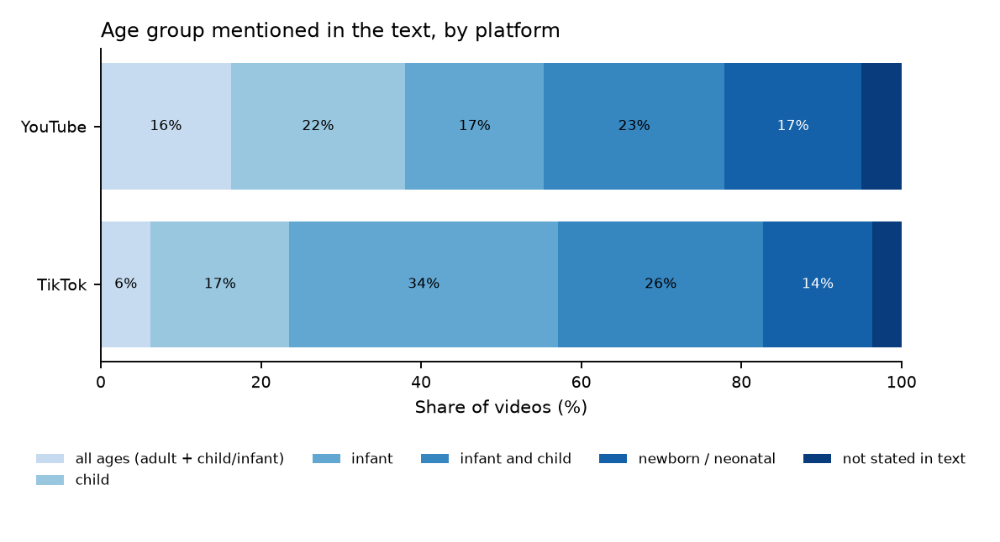

Tables: `tables/01_age_group_by_platform.csv`, `tables/01_subtopic_by_platform.csv`, `tables/01_language_by_platform.csv`, `tables/01_followers_by_platform.csv`

*Note: Subtopic and age group come from keyword matching on title, hashtags, tags and description. They are descriptive labels, not validated against human labels. The 'CPR and choking' subtopic means that both kinds of words occur anywhere in the text (for example in hashtags), not necessarily that the video teaches both. Language detection on short social-media captions is error-prone, and Roman Urdu or Hindi written in Latin letters cannot be told apart from other Latin-script languages.*

## 2. Dataset overview

Who and what is in the final dataset.

- YouTube: 542 videos (46.4% of the dataset) from 290 creators; median 1 and maximum 65 videos per creator; the top 10 creators contribute 27.5% of the videos (Gini 0.409); total length 51.3 hours.
- TikTok: 625 videos (53.6% of the dataset) from 428 creators; median 1 and maximum 26 videos per creator; the top 10 creators contribute 14.9% of the videos (Gini 0.279); total length 13.3 hours.
- Videos found by two or more of the 35 queries: YouTube 55%, TikTok 37%.
- Decision source: 205 videos have a human label and 962 were scored by the model.

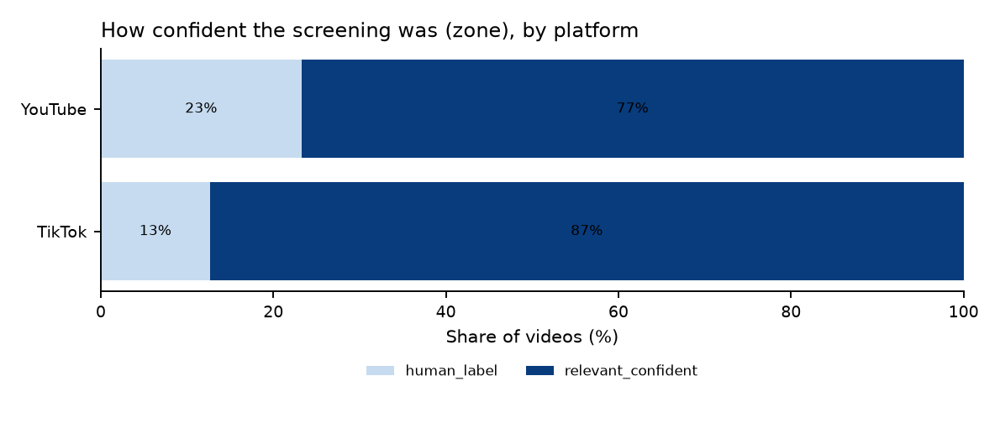

Tables: `tables/02_overview_by_platform.csv`, `tables/02_top_creators.csv`, `tables/02_zone_by_platform.csv`

*Note: These are the videos the platforms returned for the 35 queries on one day, not a random sample of all videos on the topic.*

## 3. Video duration

How long are the videos, and do the platforms differ?

- YouTube: median 175 s (2.9 min); middle half of videos between 110 and 320 s; shortest 19 s, longest 154 min; 7% are 60 seconds or shorter and 11% are longer than 10 minutes.
- TikTok: median 51 s (0.8 min); middle half of videos between 23 and 93 s; shortest 1 s, longest 38 min; 55% are 60 seconds or shorter and 0.3% are longer than 10 minutes.
- Duration: YouTube median 175 s vs TikTok median 51 s (difference +124 s, 95% CI +109 to +135); Mann-Whitney p < 0.001; Cliff's delta +0.71 (95% CI +0.67 to +0.75), large effect (positive = YouTube tends to be larger).

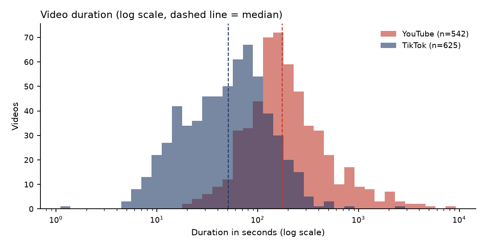

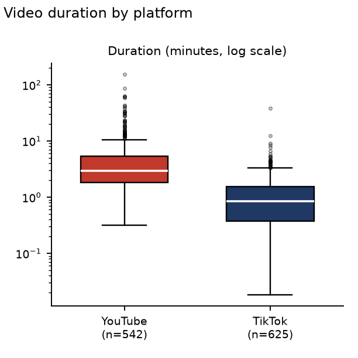

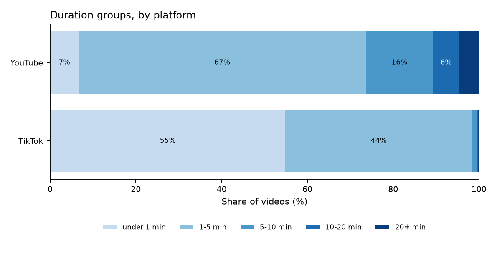

Tables: `tables/03_duration_summary_seconds.csv`, `tables/03_duration_groups.csv`, `tables/03_duration_test.csv`

*Note: Duration is strongly right-skewed, so medians, quartiles and a log scale are used instead of means. A YouTube video of 60 seconds or less may be a Short; the data do not say.*

## 4. Views

How often are the videos watched, and how concentrated are the views?

- YouTube: median 15,750 views (middle half 2,337 to 91,752); maximum 6,064,241. 16.2% of videos have fewer than 1,000 views and 29 have a million or more. The 10 most viewed videos account for 36.9% of all views and the top 10% of videos for 78.1% (Gini 0.858).
- TikTok: median 5,638 views (middle half 889 to 77,598); maximum 108,309,046. 26.7% of videos have fewer than 1,000 views and 36 have a million or more. The 10 most viewed videos account for 64.7% of all views and the top 10% of videos for 91.2% (Gini 0.939).
- Views: YouTube median 15,750 vs TikTok median 5,638 (difference +10,112, 95% CI +4,951 to +15,925); Mann-Whitney p < 0.001; Cliff's delta +0.12 (95% CI +0.06 to +0.19), negligible effect (positive = YouTube tends to be larger).

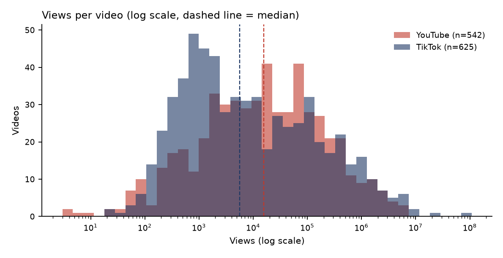

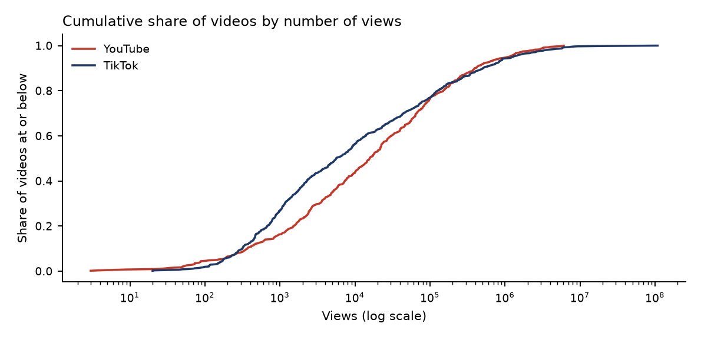

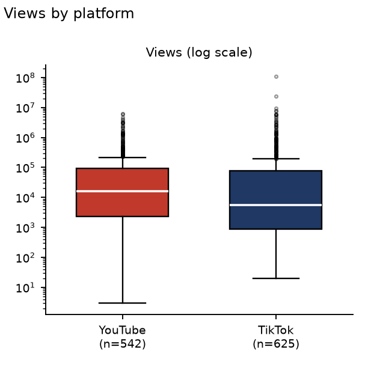

Tables: `tables/04_views_summary.csv`, `tables/04_views_concentration.csv`, `tables/04_views_test.csv`

*Note: Views are highly skewed; a few videos dominate the totals. The platforms count a 'view' differently and the data were collected on one day, so older videos have had longer to gather views. The videos are what search returned and platforms favour popular videos, so these figures describe search results, not all videos.*

## 5. Engagement

How much do viewers react? Rates are in percent of views and are computed only for videos with at least 100 views (rates of videos with very few views are unstable).

- YouTube like rate: median 0.69% (middle half 0.40% to 1.19%), available for 492 of 518 videos with at least 100 views.
- TikTok like rate: median 2.89% (middle half 1.54% to 4.77%), available for 613 of 613 videos with at least 100 views.
- YouTube comment rate: median 0.02% (middle half 0.01% to 0.06%), available for 323 of 518 videos with at least 100 views.
- TikTok comment rate: median 0.03% (middle half 0.00% to 0.11%), available for 613 of 613 videos with at least 100 views.
- Like rate: YouTube median 0.69% vs TikTok median 2.89% (difference -2.20%, 95% CI -2.47 to -1.86); Mann-Whitney p < 0.001; Cliff's delta -0.72 (95% CI -0.76 to -0.67), large effect (positive = YouTube tends to be larger).
- Comment rate: YouTube median 0.02% vs TikTok median 0.03% (difference -0.01%, 95% CI -0.02 to -0.01); Mann-Whitney p = 0.314; Cliff's delta -0.04 (95% CI -0.11 to +0.03), negligible effect (positive = YouTube tends to be larger).
- YouTube: Spearman correlation between log views and like rate rho = -0.15 (n = 492).
- TikTok: Spearman correlation between log views and like rate rho = +0.09 (n = 613).
- TikTok only: median share rate 0.23% and median save rate 0.53% of views.

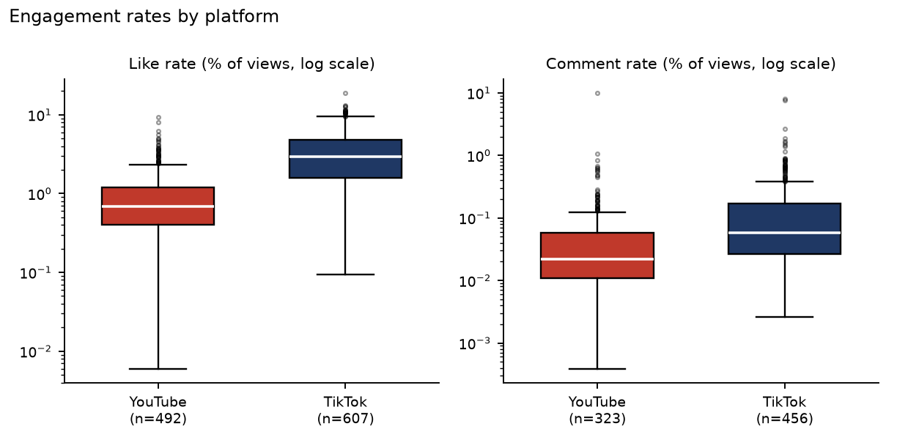

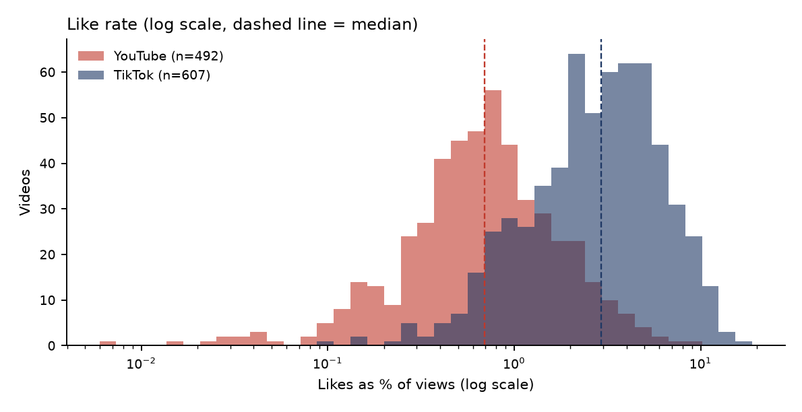

Tables: `tables/05_engagement_summary.csv`, `tables/05_engagement_tests.csv`, `tables/05_tiktok_share_save_rates.csv`, `tables/05_rate_vs_views_correlation.csv`

*Note: Videos with a rate of exactly zero (for example no comments: YouTube 0, TikTok 157) cannot be drawn on a log scale, so they are left out of the box plots only; the statistics include them.*
*Note: YouTube creators can hide likes or disable comments, and those videos are excluded from the rates, so the YouTube rates describe the videos where the counts are visible. The platforms differ in how people react (TikTok has shares and saves, YouTube has long watch sessions), so rates are compared with care and only descriptively.*

## 6. Upload trends

When were the relevant videos uploaded, and how does the observed dataset vary over time?

- Upload years in the dataset range from 2008 to 2026; 405 videos were uploaded in 2026.
- Highest observed upload months: 2026-09 (72), 2026-03 (54), 2026-06 (54).

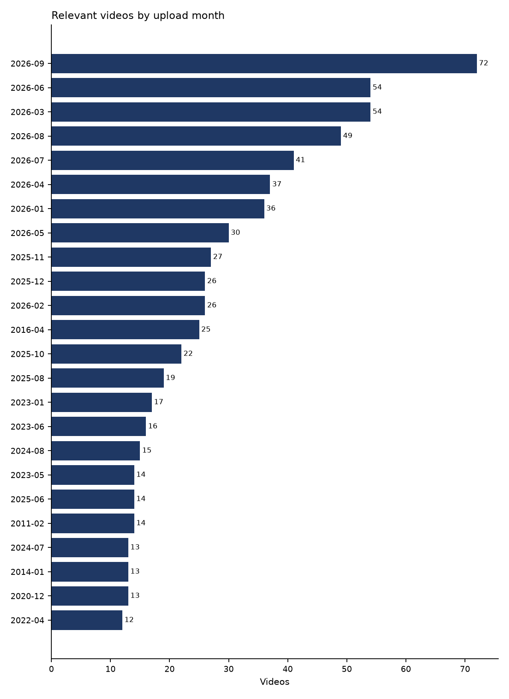

Tables: `tables/06_uploads_by_month.csv`, `tables/06_uploads_by_year.csv`

*Note: These are counts among videos returned by the 35 queries on the collection date; they are not a complete measure of how much content was published on each date.*

## 7. Language and country

What languages and countries are represented in the final relevant dataset?

- YouTube: most common detected language is en (519 videos).
- TikTok: most common detected language is en (519 videos).
- Country metadata are available mainly where the platform reports a country; the top reported country is US (355 videos).

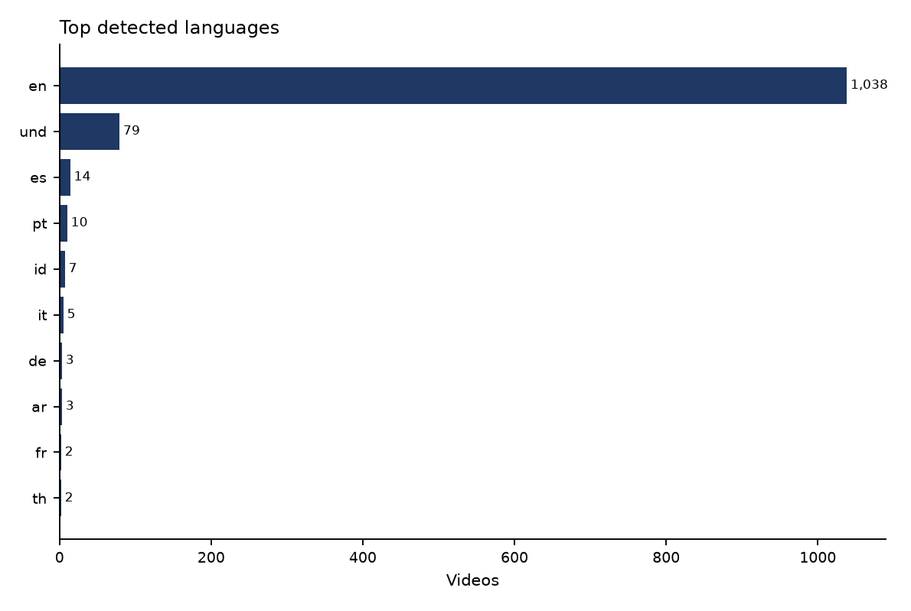

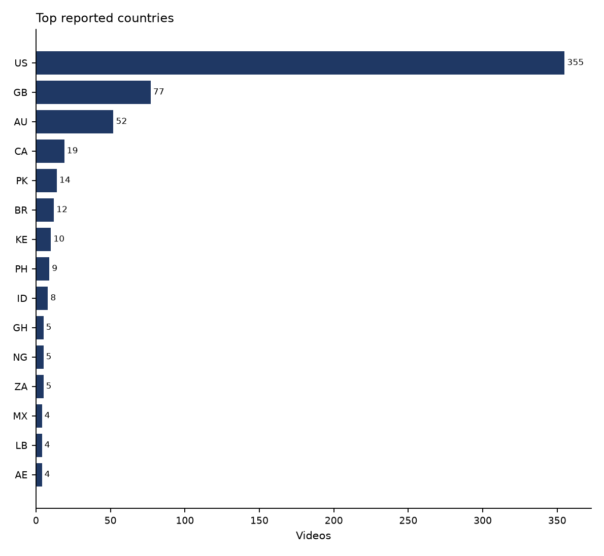

Tables: `tables/07_language_detected.csv`, `tables/07_country.csv`

*Note: Detected language is text-based and can be uncertain for short captions. Roman Urdu/Hindi written in Latin script cannot be reliably separated by this method. Country is platform-reported metadata, not a verified creator residence.*

## 8. Creator analysis

How concentrated is the relevant content among creators?

- YouTube: 292 creators for 542 videos; median 1 video per creator and maximum 64; top 10 creators contribute 27.3% of videos.
- TikTok: 428 creators for 625 videos; median 1 video per creator and maximum 26; top 10 creators contribute 14.9% of videos.

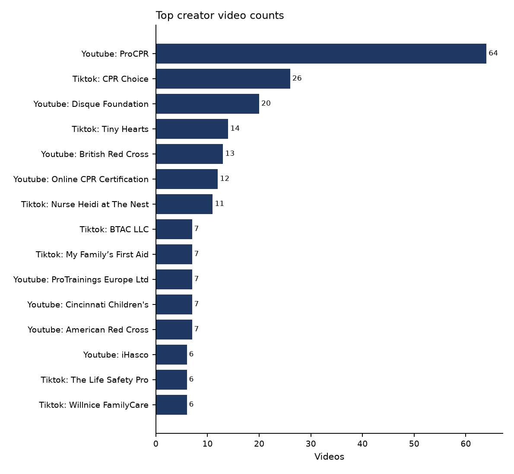

Tables: `tables/08_creator_summary.csv`, `tables/08_top_creators.csv`

*Note: Creator concentration is descriptive. The dataset is search-result based, so it does not represent the complete creator population.*

## 9. Subtopics

Which topic signals appear most often in the relevant videos?

- Most common detected subtopics: CPR and choking (283), choking (236), CPR (151), neonatal resuscitation (149), AED (140).

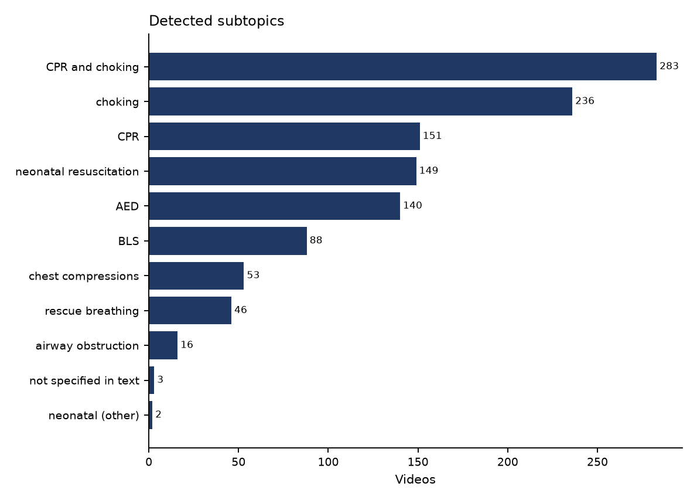

Tables: `tables/09_subtopics.csv`

*Note: Subtopics are keyword-derived from title, hashtags, tags and description. They describe text signals and do not prove that every listed procedure is actually taught in the video.*

## 10. Query analysis

Which search queries and query counts are associated with the final relevant videos?

- YouTube: median query count per relevant video is 2; maximum is 19.
- TikTok: median query count per relevant video is 1; maximum is 18.
- Most frequent query-subtopic labels among relevant rows: choking (403), cpr (356), combined (156), neonatal (135), bls (122).

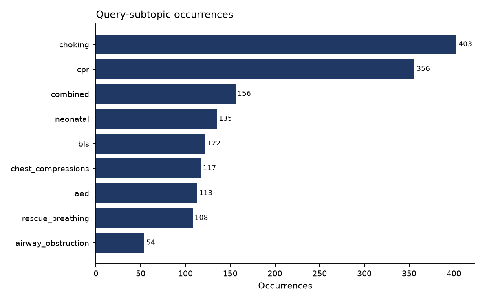

Tables: `tables/10_query_count_summary.csv`, `tables/10_query_subtopic_counts.csv`

*Note: Query/subtopic fields record how videos were discovered; they are not video-level human topic labels.*

## 11. Text analysis

What simple text characteristics are visible in titles and hashtags?

- YouTube title length: median 8 words (middle half 5-11).
- TikTok title length: median 44 words (middle half 18-98).

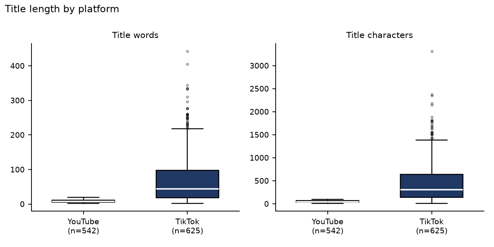

Tables: `tables/11_text_length_summary.csv`

*Note: This is a descriptive text analysis of available metadata, not a semantic analysis of the video content itself.*
